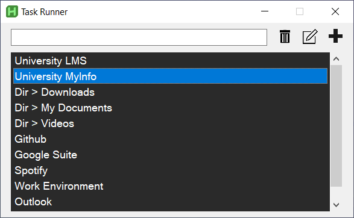

<a id="readme-top"></a>

<!-- PROJECT LOGO -->
<br />
<div align="center">

<h3 align="center" style="font-size:30px">Task Runner</h3>
  <p align="center">
    Task Runner es una aplicación gráfica construida con AutoHotKey (AHK) <br/> que simplifica la automatización de tareas diarias y repetitivas.
    <br />
    ·
    <a href="https://github.com/CarlosPereda/Task-Runner/issues/new?labels=bug&template=bug-report---.md">Reporta Errores</a>
    ·
    <a href="https://github.com/CarlosPereda/Task-Runner/issues/new?labels=enhancement&template=feature-request---.md">Solicita una función</a>
  </p>
</div>


<!-- TABLE OF CONTENTS -->
<details>
  <summary>Tabla de contenidos</summary>
  <ol>
    <li>
      <a href="#sobre-el-proyecto">Sobre el proyecto</a>
      <ul>
        <li><a href="#construido-con">Construido con</a></li>
      </ul>
    </li>
    <li>
      <a href="#primeros-pasos">Primeros pasos</a>
      <ul>
        <li><a href="#requisitos-previos">Requisitos previos</a></li>
        <li><a href="#instalacion">Instalación</a></li>
      </ul>
    </li>
    <li><a href="#uso">Uso</a>
      <ul>
        <li><a href="#ejecutar-una-tarea">Ejecutar una tarea</a></li>
        <li><a href="#crear-una-nueva-tarea">Crear una nueva tarea</a></li>
        <li><a href="#editar-una-tarea">Editar una tarea</a></li>
        <li><a href="#eliminar-una-tarea">Eliminar una tarea</a></li>        
      </ul>
    </li>
    <li><a href="#hoja-de-ruta">Hoja de ruta</a>
  </ol>
</details>


<!-- ABOUT THE PROJECT -->
## Sobre el proyecto
<div align="center" style="margin-bottom: 20px">
  <a href="https://github.com/CarlosPereda/Task-Runner">
    
  </a>
</div>

¿Alguna vez has querido una forma centralizada de gestionar todos tus scripts? O quizás te has quedado sin atajos para ejecutar tareas automatizadas.

Task Runner cuenta con una única ventana de búsqueda intuitiva donde los usuarios pueden acceder rápidamente a cualquier script predefinido. Ya sea abrir aplicaciones de uso frecuente, gestionar archivos o ejecutar secuencias complejas de acciones, Task Runner simplifica tu flujo de trabajo permitiéndote buscar y ejecutar tus scripts personalizados de AHK sin esfuerzo.
<p align="right">(<a href="#task-runner">volver arriba</a>)</p>


### Construido con

* AutoHotkey v2.0.11

<p align="right">(<a href="#task-runner">volver arriba</a>)</p>

<!-- GETTING STARTED -->
## Primeros pasos

### Requisitos previos

Necesitas tener instalada cualquier versión de AHKv2 en tu ordenador. Para usar este software es muy recomendable conocer los conceptos básicos de AutoHotkey. Puedes obtener AutoHotkey en https://autohotkey.com/

### Instalación

- <b>Opción 1:</b> Clonar o descargar el repositorio
   ```sh
   git clone https://github.com/CarlosPereda/Task-Runner
   ```

- <b> Opción 2: </b> También puedes incluir GUI_TaskRunner.ahk en un script AHK existente que ya estés usando. Copia este codigo en tu Main.ahk o el arvhivo AHK que uses principalmente
   ```js
   #Include Your/Path/TaskRunner/GUI_TaskRunner.ahk

   F9::GuiTaskRunner().draw_gui()

   #HotIf WinActive("Task Runner")
   F9::Send("{Enter}")
   #HotIf
   ```
<p align="right">(<a href="#task-runner">volver arriba</a>)</p>

<!-- USAGE EXAMPLES -->
## Uso

### Ejecutar una tarea
1. Ejecuta Main.ahk (mira requisitos previos
2. Pulsa ```F9``` en tu teclado para abrir la interfaz de Task Runner
3. Pulsa ```ESPACIO``` para ver todas las tareas disponibles o escribe una tarea específica
4. Selecciona una tarea para ejecutarla (puedes ejecutarla con doble clic, ```F9``` o ```Enter```)

### Crear una nueva tarea
1. En la interfaz de Task Runner, haz clic en el botón Plus o pulsa ```Ctrl+N``` 
2. En la sección "Task Name", escribe el nombre de la tarea (este es lo que aparece en el buscador)
3. En la sección "Content", escribe o pega tu script de AHK (por ejemplo ```run('https://www.youtube.com/')```)
4. En la sección "Keywords", escribe las palabras con las que quieres poder buscar la tarea
5. Modifica la prioridad para cambiar la posición de la tarea en la lista
6. Haz clic en Save

### Editar una tarea
1. Con una tarea seleccionada en la interfaz, haz clic en el botón Edit o pulsa ```Ctrl+E```.
2. Realiza los cambios que necesites (para editar el contenido en tu editor de texto por defecto puedes pulsar ```Ctrl+o```)
3. Haz clic en Save

### Eliminar una tarea
1. Con una tarea seleccionada en la interfaz, haz clic en el icono de papelera o pulsa```DELETE```.
2. Acepta

<p align="right">(<a href="#task-runner">volver arriba</a>)</p>


<!-- ROADMAP -->
## Hoja de ruta

- [ ] Añadir logo/icono

<p align="right">(<a href="#task-runner">volver arriba</a>)</p>
