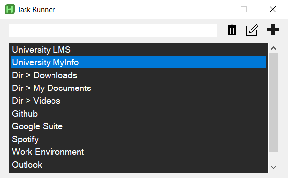

<a id="readme-top"></a>

<!-- PROJECT LOGO -->
<br />
<div align="center">

<h3 align="center" style="font-size:30px">Task Runner</h3>
  <p align="center">
    Task Runner is a graphical application built with  AutoHotKey (AHK) <br/> that simplifies automating daily and repetitive tasks.
    <br />
    ·
    <a href="https://github.com/CarlosPereda/Task-Runner/issues/new?labels=bug&template=bug-report---.md">Report Bug</a>
    ·
    <a href="https://github.com/CarlosPereda/Task-Runner/issues/new?labels=enhancement&template=feature-request---.md">Request Feature</a>
  </p>
</div>


<!-- TABLE OF CONTENTS -->
<details>
  <summary>Table of Contents</summary>
  <ol>
    <li>
      <a href="#about-the-project">About The Project</a>
      <ul>
        <li><a href="#built-with">Built With</a></li>
      </ul>
    </li>
    <li>
      <a href="#getting-started">Getting Started</a>
      <ul>
        <li><a href="#prerequisites">Prerequisites</a></li>
        <li><a href="#installation">Installation</a></li>
      </ul>
    </li>
    <li><a href="#usage">Usage</a>
      <ul>
        <li><a href="#run-a-task">Run a task</a></li>
        <li><a href="#create-a-new-task">Create a new task</a></li>
        <li><a href="#edit-a-task">Edit a task</a></li>
        <li><a href="#delete-a-task">Delete a task</a></li>        
      </ul>
    </li>
    <li><a href="#roadmap">Roadmap</a>
  </ol>
</details>


<!-- ABOUT THE PROJECT -->
## About The Project
<div align="center" style="margin-bottom: 20px">
  <a href="https://github.com/CarlosPereda/Task-Runner">
    
  </a>
</div>

Have you ever wanted a centralized way to manage all your scripts? Or perhaps you've run out of shortcuts for running automated tasks.

Task Runner features a single, intuitive search window where users can quickly access any predefined scripts. Whether it's opening frequently used applications, managing files, or performing complex sequences of actions, Task Runner streamlines your workflow by letting you search and execute your custom AHK scripts effortlessly.

<p align="right">(<a href="#readme-top">back to top</a>)</p>


### Built With

* AutoHotkey v2.0.11

<p align="right">(<a href="#readme-top">back to top</a>)</p>

<!-- GETTING STARTED -->
## Getting Started

### Prerequisites

You need to have any version of AHKv2 installed to your computer. To use this software it is strongly recommended that you know the basics of AutoHotkeys. You can get AutoHotkeys from https://autohotkey.com/

### Installation

1. Just clone or download the repository
   ```sh
   git clone https://github.com/CarlosPereda/Task-Runner
   ```

2. Alternatively, you can include GUI_TaskRunner.ahk to an existing ahk script that you are already using. Copying the hotkeys behaviour from Main.ahk is advisable.
   ```js
   #Include Your/Path/TaskRunner/GUI_TaskRunner.ahk

   F9::GuiTaskRunner().draw_gui()

   #HotIf WinActive("Task Runner")
   F9::Send("{Enter}")
   #HotIf
   ```
<p align="right">(<a href="#readme-top">back to top</a>)</p>

<!-- USAGE EXAMPLES -->
## Usage

### Run a task
1. Execute Main.ahk 
2. Press ```F9``` on your Keyboard to open the Task Runner GUI
3. Type SPACE to see all available tasks or search for a specific task
4. Select a task to run it (You can run it with ```F9```)

### Create a new task
1. In the Task Runner GUI, click the Plus button or press ```Ctrl+N``` 
2. In the "Task Name" section, type a name for the task
3. In the "Content" section, type or copy your AHK script in the content section
4. In the "Keywords" section, type the words by which you want to search the task
5. Modify priority to change task position in the task list.
6. Click Save

### Edit a task
1. While highlighting a task in the gui, click the Edit button or press ```Ctrl+E```.
2. Make changes (To change the contents in your default text editor you can press ```Ctrl+o```)
3. Click save

### Delete a task
1. While highlighting a task in the gui, click the trash button or press ```DELETE```.
2. Accept 

<p align="right">(<a href="#readme-top">back to top</a>)</p>


<!-- ROADMAP -->
## Roadmap

- [ ] Add Icon/Logo
- [ ] Document PreConditions and PostConditions in the code 
- [ ] Document internal functionality
- [ ] Add a licence
- [ ] Test in Windows 11

<p align="right">(<a href="#readme-top">back to top</a>)</p>
